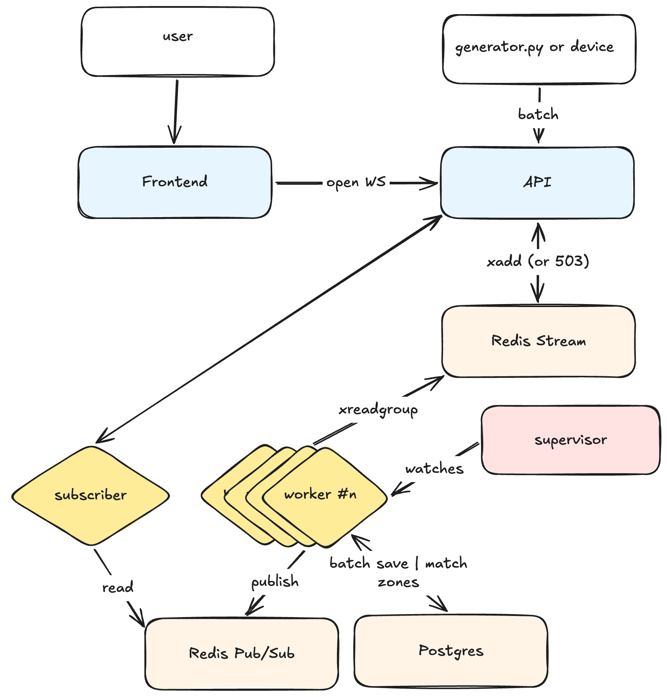

# Geo device

Real-time geo-tracking alerting service

- **Backend** — Python 3.14, FastAPI, SQLAlchemy 2 (async), Alembic
- **Storage** — PostgreSQL 17 + PostGIS 3.5, Redis 7 (ingest stream + pub/sub + alert state)
- **Frontend** — one static Leaflet page, served by the app itself


## Run with Docker

```bash
cp .env.example .env
docker compose up --build -d
```

- API — <http://localhost:8000>
- Demo map — <http://localhost:8000/api/v1/ui/>
- Swagger — <http://localhost:8000/docs>, (only with `ENV=DEV`)

## Load generator

Simulated devices drift around a center and report through the real HTTP ingest endpoint

```bash
uv sync
uv run python generator.py
uv run python generator.py --devices 2000 --interval 1
```

| Flag         | Default                              | Meaning                               |
|--------------|--------------------------------------|---------------------------------------|
| `--url`      | `http://localhost:8000/ingest/batch` | Ingest endpoint                       |
| `--devices`  | 10000                                | Simulated devices                     |
| `--interval` | 3.0                                  | Seconds between reports of one device |
| `--drift`    | 0.0005                               | Max degrees moved per tick            |

Batch size (500 pings per request) and in-flight request concurrency (16) are constants in the script.

One line per tick:

```
tick    1 |  0.42s | accepted   9500 | pings/s    22619 | rejected     0 | failed     0
```

| Field      | Meaning                                                                             |
|------------|-------------------------------------------------------------------------------------|
| `accepted` | Pings the API answered `202` for                                                    |
| `pings/s`  | `accepted / tick duration` — burst rate; sustained load is `--devices / --interval` |
| `rejected` | Pings refused with `503` because the ingest backlog was full                        |
| `failed`   | Pings lost to transport errors or an unexpected status                              |

## API

Every REST call identifies the user with the `X-User-ID` header. Geozones are strictly isolated per user.

| Method   | Path              | Purpose                                                                                     |
|----------|-------------------|---------------------------------------------------------------------------------------------|
| `POST`   | `/ingest/batch`   | Ingest a batch of device locations (`202`, or `503 + Retry-After` when the backlog is full) |
| `POST`   | `/geozones`       | Create a zone: `name`, `lat`, `lon`, `radius_m`                                             |
| `GET`    | `/geozones`       | List own zones (`limit`, `offset`)                                                          |
| `GET`    | `/geozones/{id}`  | Retrieve one                                                                                |
| `PATCH`  | `/geozones/{id}`  | Update name, center or radius                                                               |
| `DELETE` | `/geozones/{id}`  | Delete                                                                                      |
| `GET`    | `/health`         | Liveness                                                                                    |
| `WS`     | `/ws?user_id=...` | Live positions and alerts                                                                   |

### WebSocket protocol

```jsonc
// a snapshot per ingest worker every ~1s (so up to INGEST_WORKERS messages per second),
{"type": "device_positions", "positions": [["dev-00001", 50.4501, 30.5234, "2026-09-15T08:00:00+00:00"]]}

// when a device enters one of this user's zones
{"type": "geozone_alert", "alerts": [{
  "user_id": "alice", "geozone_id": 7, "geozone_name": "warehouse",
  "device_id": "dev-00001", "lat": 50.4501, "lon": 30.5234,
  "recorded_at": "2026-09-15T08:00:00+00:00"
}]}
```

## Architecture



Source: [`docs/architecture.excalidraw`](docs/architecture.excalidraw) (open in <https://excalidraw.com>).

### Components

| Component                | File                               | What it does                                                                                                                                                                                                                                                                                          |
|--------------------------|------------------------------------|-------------------------------------------------------------------------------------------------------------------------------------------------------------------------------------------------------------------------------------------------------------------------------------------------------|
| **Redis Stream** `pings` | `app/pipeline/stream.py`           | Buffer between ingest and the database. `POST /ingest/batch` only does an `XADD` and returns `202`, so a slow database never holds up the request. A `pings:pending` counter tracks unwritten pings and trips the `503 + Retry-After` gate.                                                           |
| **Ingest workers**       | `app/pipeline/worker/worker.py`    | `INGEST_WORKERS` consumers in one group. Each loop: `XREADGROUP` a few entries, bulk-insert the pings, match them against geozones, publish alerts and positions, `XACK`. Picks up entries left behind by a dead consumer with `XAUTOCLAIM`, and drains the stream on shutdown.                       |
| **Supervisor**           | `app/pipeline/worker/lifecycle.py` | Runs the ingest workers and the retention pass as supervised tasks. Restarts any task that exits, crashes, or misses its heartbeat for 60s, and counts restart flapping.                                                                                                                              |
| **Matcher**              | `app/pipeline/matcher.py`          | One SQL statement per batch. Pings get `unnest`ed into a values list and joined against `geozones`. The GiST index on `bounds` cuts the candidate list, then `ST_DWithin` on `geography` does the exact check. Python never touches distances.                                                        |
| **Presence**             | `app/pipeline/presence.py`         | Answers "just entered", not "is inside". A Redis set per device holds its current zones; a Lua script syncs that set and returns only the new ones, so a device parked in a zone alerts once instead of every ping. The key expires after `INGEST_ZONE_ENTRY_TTL_S`, so silent devices get forgotten. |
| **Redis Pub/Sub**        | `app/realtime/events.py`           | Fan-out between processes. Positions go to one shared `positions` channel; alerts go to a per-user `alerts:{user_id}` channel, which is what keeps zones isolated across connections.                                                                                                                 |
| **Subscriber**           | `app/realtime/subscriber.py`       | One pub/sub connection per process. Subscribes to `alerts:{user_id}` on a user's first connection, unsubscribes when the last one leaves, and dispatches each message into the registry. Resubscribes with backoff if Redis drops it.                                                                 |
| **Connection registry**  | `app/realtime/registry.py`         | `user_id → set of connections`, so one user gets the same stream on laptop and phone. Every connection has its own bounded queue and sender task. A slow client can't stall dispatch: its positions get dropped, while alerts evict older messages to get through.                                    |
| **Retention worker**     | `app/pipeline/retention.py`        | Deletes `location_pings` rows older than `INGEST_RETENTION_DAYS` in batches, keeping the table bounded.                                                                                                                                                                                               |


### Ingest path and high throughput

```
device → POST /ingest/batch → Redis Stream "pings" → consumer group → ingest workers
                                                                          ├→ bulk INSERT into location_pings
                                                                          ├→ bounds && point → ST_DWithin → alerts:{user_id}
                                                                          └→ 1s position snapshot → positions
```

```
app/
  core/            config, db, logging, redis client, shared types
  domains/         devices (ingest) and geozones (CRUD)
  pipeline/        redis stream wrapper, matcher, presence, retention, worker/ (ingest loop + supervisor)
  realtime/        websocket registry, pub/sub subscriber, event publishers
migrations/        alembic revisions
tests/             unit / integration / e2e suites for the core logic
frontend/          Leaflet demo UI (should be in separate repo)
```

## Configuration

All settings come from `.env` (see `.env.example`);

| Variable                                                    | Default        | Meaning                                                      |
|-------------------------------------------------------------|----------------|--------------------------------------------------------------|
| `INGEST_WORKERS`                                            | 4              | Stream consumers per process; bounds the DB connection usage |
| `INGEST_CHUNK_SIZE`                                         | 500            | Pings per stream entry                                       |
| `INGEST_MAX_HTTP_BATCH_SIZE`                                | 1000           | Hard cap on one ingest request                               |
| `INGEST_BACKLOG_LIMIT`                                      | 200000         | Unwritten **pings** above which ingest answers `503`         |
| `INGEST_STREAM_MAX_LEN`                                     | 4000           | Stream trim length, in entries (~200 MB of Redis)            |
| `INGEST_DRAIN_TIMEOUT_S`                                    | 10             | Shutdown drain budget                                        |
| `INGEST_ZONE_ENTRY_TTL_S`                                   | 60             | How long a device stays "inside" without reporting           |
| `INGEST_POSITION_FLUSH_INTERVAL_S`                          | 1.0            | Live-map snapshot period                                     |
| `INGEST_MAX_PING_AGE_S` / `INGEST_MAX_PING_SKEW_S`          | 86400 / 300    | Accepted `recorded_at` window                                |
| `INGEST_RETENTION_DAYS`                                     | 7              | How long `location_pings` rows are kept                      |
| `INGEST_RETENTION_INTERVAL_S`                               | 3600           | Period of the retention pass                                 |
| `REALTIME_QUEUE_SIZE`                                       | 64             | Per-connection send queue                                    |
| `POSTGRES_TEST_DATABASE` / `POSTGRES_TEST_HOST`             | — / localhost  | Database and host used by integration and e2e tests          |
| `REDIS_TEST_DB` / `REDIS_TEST_HOST`                         | 15 / localhost | Redis db and host used by integration and e2e tests          |
| `POSTGRES_POOL_SIZE` / `POSTGRES_MAX_OVERFLOW`              | 10 / 10        | SQLAlchemy pool, per uvicorn worker                          |
| `POSTGRES_CONNECT_TIMEOUT_S` / `POSTGRES_COMMAND_TIMEOUT_S` | 5 / 15         | asyncpg timeouts — a dead database fails fast                |
